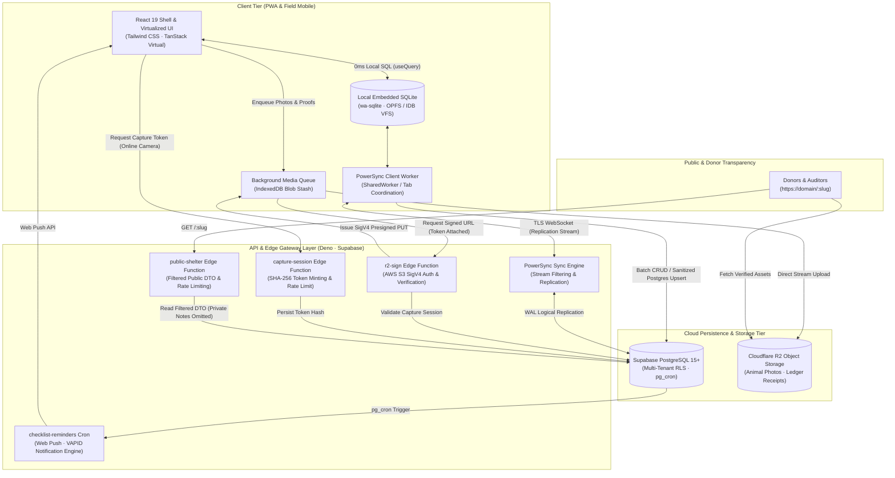

# Sanctuary · Shelter Management System

<div align="center">

[](https://react.dev/)
[](https://www.typescriptlang.org/)
[](https://vitejs.dev/)
[](https://www.powersync.com/)
[](https://supabase.com/)
[](https://developers.cloudflare.com/r2/)
[](https://vitest.dev/)
[](https://web.dev/progressive-web-apps/)
[](./LICENSE)

**Mission-critical, offline-first shelter management software built for animal rescues and long-term sanctuaries operating in high-constraint, low-connectivity environments.**

[Executive Overview](#executive-overview) • [System Architecture](#system-architecture) • [Technical Highlights](#key-features--technical-highlights) • [Tech Stack](#tech-stack) • [Testing Pyramid](#testing--verification-pyramid) • [Local Setup](#local-development-setup) • [Security & Privacy](#security-privacy--data-safeguards)

---

</div>

## Executive Overview

### The Problem
Animal shelters, sanctuaries, and field rescue teams in emerging economies and low-resource regions operate under severe operational friction:
- **Zero or Intermittent Connectivity**: Frequent power outages, rural field operations, and unstable cellular networks render cloud-only SaaS platforms completely unusable.
- **Fragmented Operational Records**: Daily rounds, medical treatments, animal intake, and financial receipts are typically split across physical paper notebooks, private WhatsApp messages, and disconnected spreadsheets.
- **Donor Trust Deficits**: Charitable rescue operations struggle to verify their actual animal headcount, prove the authenticity of intake photos, and demonstrate transparent stewardship of donated funds.

### The Solution: Sanctuary
Sanctuary is an enterprise-grade, mobile-first Progressive Web Application (PWA) engineered from the ground up for resilience. Designed and deployed by **The Mohsin Project Global (SMC) Pvt. Ltd.**, Sanctuary replaces scattered informal tracking with a local-first system of record.

- **Real-World Operational Scale**: Deployed in live field pilot operations with **Tales of Second Chances (TOSC)** in Pakistan, managing active care for **300+ animals** simultaneously across canine, feline, and specialized rescue populations.
- **True Offline Capability**: The user interface reads and writes exclusively to an embedded WebAssembly SQLite database running locally inside the mobile browser. Field workers can execute intake, log medical treatments, record expenses, and audit daily rounds with **0ms latency** and zero network connectivity.
- **Cryptographic Trust & Transparency**: Features an authenticated, server-verified camera pipeline that mints single-use capture tokens to prevent photo reuse or counterfeit donation appeals, alongside public transparency endpoints (`/{slug}`) protected by strict privacy redactions.

---

## System Architecture

Sanctuary implements a **Local-First / Dynamic Replication** architecture. The client maintains an autonomous local relational database (`wa-sqlite`) that synchronizes bidirectionally with a multi-tenant PostgreSQL backend through partitioned WAL replication streams. High-bandwidth media and sensitive public reads bypass the sync layer through dedicated edge functions and object storage.



### Architectural Highlights
1. **Zero-Roundtrip Data Path**: All UI mutations and queries execute against browser-local SQLite. No spinner blocks user input during cellular dead-zones or server hiccups.
2. **Deterministic Partitioning**: PowerSync Sync Streams filter operational data strictly to the authenticated user's organization (`user_orgs = SELECT org_id FROM org_members WHERE user_id = auth.user_id()`), guaranteeing multi-tenant isolation before data leaves the server.
3. **Bandwidth Decoupling**: High-resolution photography and expense attachments are decoupled from the transactional database. Blobs stream directly from the browser to Cloudflare R2 via presigned S3 SigV4 URLs generated by Deno Edge Functions.

---

## Key Features & Technical Highlights

### 1. In-Browser WASM SQLite with Hybrid VFS Strategy
- **Low-Level Engine**: Powered by `@journeyapps/wa-sqlite` and `@powersync/web`, compiling SQLite to WebAssembly for execution in web worker threads.
- **Dynamic File System Adapter**: Automatically detects platform capabilities to select the optimal Virtual File System (VFS):
  - **Chromium / Android**: Utilizes `WASQLiteVFS.OPFSCoopSyncVFS` (Origin Private File System Access Handles) with `SharedWorker` multi-tab synchronization for maximum I/O throughput.
  - **WebKit / iOS Safari**: Gracefully falls back to `WASQLiteVFS.IDBBatchAtomicVFS` to prevent Safari IndexedDB file handle lock contention.
- **Type-Safe Schema Compilation**: Declarative schema definition in TypeScript with automated SQLite-to-PostgreSQL boolean sanitization (`sanitizeForPostgres`) preventing datatype collisions across sync boundaries.

### 2. Cryptographic Photo Attestation & Verification Pipeline
- **Combating Rescue Fraud**: To prevent bad actors from recirculating old or scraped images for funding, Sanctuary implements a zero-trust photo verification mechanism.
- **Single-Use Capture Tokens**: When taking a photo with the in-app camera while online, the client requests a short-lived capture session from `supabase/functions/capture-session`. Only the SHA-256 hash of the token is stored in the database.
- **Server-Enforced Attestation Trigger**: During upload, `supabase/functions/r2-sign` verifies the token and marks the photo as verified using `service_role` credentials.
- **Anti-Tamper PostgreSQL Trigger**: A database trigger (`photos_enforce_verified_trg`) blocks authenticated client sessions from self-attesting `verified = true`—any unauthorized modification is automatically reverted at the database engine level.

```sql
-- Database-level defense against client-side verification spoofing
create or replace function public.photos_enforce_verified()
returns trigger language plpgsql as $$
begin
  if tg_op = 'INSERT' then
    new.verified := false;
  elsif tg_op = 'UPDATE' then
    if new.verified is distinct from old.verified then
      if current_setting('request.jwt.claim.role', true) = 'service_role'
         or current_user in ('service_role', 'supabase_admin', 'postgres') then
        return new;
      end if;
      new.verified := old.verified; -- Revert client attempt to self-verify
    end if;
  end if;
  return new;
end;
$$;
```

### 3. Multi-Status Domain Engine & "Exit-Wins" Invariant
- **Complex Veterinary States**: Rescued animals rarely occupy a single linear status. Sanctuary supports concurrent multi-status assignments (e.g., an animal can simultaneously be in *Quarantine* and *Medical Treatment*).
- **Exclusive Terminal States**: Exit statuses (*Adopted*, *Deceased*, *Transferred*) represent terminal out-of-care states.
- **Deterministic Headcount Logic**: Headcount metrics follow an airtight invariant:
  > **In-Care Invariant**: An animal is counted in-care if and only if it has **at least one active status** marked `counts_as_in_care = true` AND **zero statuses** marked `counts_as_in_care = false` (the deterministic "exit-wins" principle).

  Assigning any out-of-care status requires explicit confirmation and atomically revokes active care statuses, maintaining audit integrity across the herd.

### 4. Daily Care Round Checklist with Automated Web Push Engine
- **Operational Herd Management**: Field staff conduct daily morning and evening rounds across hundreds of animals. The checklist system tracks daily checkmarks resetting precisely at midnight in the shelter's local timezone (`Asia/Karachi`).
- **Streak & Overdue Intelligence**: Evaluates completed streaks, flags missed rounds, and aggregates urgent care requirements on the executive dashboard.
- **Serverless Push Notifications**: Supabase Edge Functions (`checklist-reminders`) run via scheduled cron jobs to dispatch VAPID-signed Web Push notifications directly to staff mobile devices:
  - **Evening Reminder (18:00 PKT / 13:00 UTC)**: Alerts staff of uncompleted care items before nightfall.
  - **Morning Overdue Alert (08:00 PKT / 03:00 UTC)**: Notifies supervisors of items that remained unchecked from the prior day.

### 5. Privacy-Preserving Public Transparency Portal (`/{slug}`)
- **Audited Public Ledger**: Sanctuaries can publish an opt-in public transparency profile (`https://<domain>/<slug>`) providing real-time headcount and financial reporting.
- **Hardened Data Boundaries**: Public visitors have **zero direct access** to database tables, PostgreSQL connection pools, or PowerSync endpoints.
- **Edge DTO Filtration**: All public requests are routed through the `public-shelter` Deno Edge Function, which executes deterministic privacy transformations:
  - Private clinical and internal staff notes (`animals.notes`, `treatments.notes`) are excluded entirely.
  - Anonymous donations (`is_anonymous = true`) have donor names and receipt attachment links suppressed.
  - Rate-limited via durable database token buckets (60 req/min per IP; 120 req/min per slug), inspecting the rightmost proxy header to prevent spoofing.

### 6. Resilient Background Media Queue & PWA Service Worker
- **Non-Blocking Field Captures**: Photos and financial expense receipts taken in the field are stored instantly in IndexedDB and queued in SQLite with state tracking (`pending` → `uploading` → `uploaded` | `failed`).
- **Background Dispatcher**: An active queue manager automatically senses network connectivity transitions, requests S3 presigned URLs, and drains pending uploads in the background without requiring the user to remain on the edit screen.
- **Version Integrity Checking**: PWA deployments write a lightweight `version.json` payload on build. When field devices reconnect or return to the foreground, a non-intrusive update banner alerts staff to refresh and adopt new code versions.

---

## Tech Stack

| Domain | Technology / Library | Purpose & Rationale |
|---|---|---|
| **Client Core** | React 19.1, TypeScript 5.8 | Latest React concurrent features, transitions, and strict type safety |
| **Build & Bundler** | Vite 6.3, `@vitejs/plugin-react` | Ultra-fast HMR and optimized Rollup asset splitting |
| **Offline DB Engine** | `@powersync/web`, `@journeyapps/wa-sqlite` | In-browser WebAssembly SQLite with OPFS and IDB batch atomic backends |
| **Cloud Database** | PostgreSQL 15+ (Supabase) | Multi-tenant relational storage, Row Level Security (RLS), and pg_cron |
| **Sync Protocol** | PowerSync Cloud (Edition 3 Streams) | Bidirectional logical replication and filtered tenant streaming |
| **Edge Functions** | Deno, TypeScript, `@supabase/supabase-js` | Serverless edge APIs for cryptographic signing, cron jobs, and DTO delivery |
| **Object Storage** | Cloudflare R2 | S3-compatible, zero-egress-cost storage for animal photos and receipts |
| **UI & Styling** | Custom Sage Design System, Tailwind CSS | High-contrast, mobile-first design (`#87A96B` sage, `#F5F1E8` warm sand) |
| **Icons & Typography** | `@phosphor-icons/react`, Fontsource (DM Sans, Outfit) | Clean iconography and preloaded typography optimized for low latency |
| **List Virtualization** | `@tanstack/react-virtual` | DOM virtualization maintaining 60fps scrolling across 1,000+ animal records |
| **Drag & Drop** | `@dnd-kit/core`, `@dnd-kit/sortable` | Accessible status reordering and checklist curation |
| **Data Export** | `jszip`, `html-to-image` | On-device ZIP generation (CSVs + images) and shareable PNG dashboard cards |
| **Push Notifications** | `web-push`, Web Push API (VAPID) | Cross-platform mobile notifications for care round alerts |
| **Testing** | Vitest 3.1, `@testing-library/react`, JSDOM | Lightning-fast unit, domain invariant, and component integration testing |

---

## Repository Structure

```text
sanctuary/
├── .github/
│   └── workflows/
│       └── supabase-production.yml    # CI/CD: Automated migration & edge function deploy to prod
├── powersync/
│   ├── sync-rules.yaml                # Legacy PowerSync rules specification
│   └── sync-streams.yaml              # PowerSync Sync Streams (edition 3) tenant partition rules
├── public/                            # Static assets, PWA icons, splash screens, web manifest
├── scripts/
│   ├── db-setup.mjs                   # Idempotent database schema migration & org seed runner
│   ├── load-env.mjs                   # Environment variable loader for CLI scripts
│   └── supabase-dev.mjs               # Safety CLI wrapper targeting DEV only (blocks prod refs)
├── src/
│   ├── app/
│   │   ├── App.tsx                    # Root application component & layout shell
│   │   ├── providers.tsx              # React context providers (PowerSync, Auth, Theme)
│   │   └── router.tsx                 # Client routing, navigation guards, and onboarding locks
│   ├── features/
│   │   ├── animals/                   # Animal profiles, multi-status chips, intake, search
│   │   ├── auth/                      # Authentication flows & session state
│   │   ├── checklist/                 # Daily care rounds checklist, streak tracking, Web Push
│   │   ├── dashboard/                 # Headcount analytics, financial snapshot, shareable cards
│   │   ├── ledger/                    # Income & expense ledger, multi-currency (PKR/USD), proof attachments
│   │   ├── onboarding/                # Guided first-time setup wizard for new shelters
│   │   ├── photos/                    # Camera capture, local photo caching, gallery handling
│   │   ├── public/                    # Opt-in donor transparency portal (/{slug})
│   │   ├── settings/                  # Org profile, custom statuses, categories, data export
│   │   ├── statuses/                  # Status assignment domain logic & "exit-wins" invariants
│   │   ├── sync/                      # PowerSync SQLite database, schema, and Supabase connector
│   │   ├── treatments/                # Medical treatment history & care event logging
│   │   └── uploads/                   # Background media queue runner & retry manager
│   └── shared/
│       ├── hooks/                     # Custom React hooks (useCurrentMember, useDebounce, etc.)
│       ├── lib/                       # Utility libraries (CSV export, R2 signed URLs, dates, IDs)
│       └── ui/                        # Accessible design system components (buttons, dialogs, sync banner)
├── supabase/
│   ├── functions/
│   │   ├── _shared/                   # Shared Deno utilities (rate limiting, crypto helpers)
│   │   ├── capture-session/           # Mints short-lived photo attestation session tokens
│   │   ├── checklist-reminders/       # Scheduled Web Push notification cron for daily care rounds
│   │   ├── public-shelter/            # Public read-only DTO endpoint for donor transparency
│   │   ├── push-subscribe/            # Web Push subscription management endpoint
│   │   └── r2-sign/                   # S3 SigV4 pre-signing for Cloudflare R2 uploads & deletes
│   ├── migrations/                    # 15 declarative PostgreSQL migration scripts
│   ├── config.toml                    # Supabase CLI project configuration
│   └── seed.sql                       # Base database seed data
├── tests/
│   ├── setup/                         # Vitest environment setup & custom matchers
│   └── unit/                          # 140 unit tests across 29 suites (domain, invariant, UI)
├── index.html                         # PWA HTML entry point & web font preloading
├── package.json                       # Dependencies, scripts, and project metadata
├── vite.config.ts                     # Vite 6 config, PWA manifest generation, WASM support
└── LICENSE                            # Source-Available Portfolio Evaluation License
```

---

## Testing & Verification Pyramid

Sanctuary enforces comprehensive automated testing across core invariants, domain state machines, data formatting, and UI components.

```
                  ▲
                 / \
                /   \     Manual Field Pilot Runbook
               /  5  \    (Airplane mode, PWA installation,
              /───────\    hardware camera, real R2 upload)
             /         \
            /    29     \   Integration & Component Tests
           / Test Suites \  (Onboarding flow, navigation guards,
          /───────────────\  SyncBanner state transitions)
         /                 \
        /        140        \   Unit & Domain Invariant Tests
       /   Tests (Passed)    \  (Headcount "exit-wins", CSV UTF-8 Urdu,
      /───────────────────────\  currency math, sanitizeForPostgres, IDs)
```

### Automated Test Suite
Run the full test suite with Vitest:

```bash
npm test -- --run
```

#### Coverage Highlights
- **Domain Invariants**:
  - `statusInCare.test.ts` & `countInCare.test.ts`: Proves the "exit-wins" rule (an animal with both an in-care and out-of-care status is strictly counted as out-of-care).
  - `assignments.test.ts`: Validates status assignment transitions, ensuring selecting an exit status atomically deselects active statuses.
- **Data Integrity & Multilingual Escaping**:
  - `csv.test.ts`: Verifies RFC 4180 CSV generation and formula-injection defenses, ensuring bidirectional UTF-8 text (including Urdu clinical notes) exports cleanly without corrupting spreadsheet parsers.
  - `connectorSanitize.test.ts`: Validates data transformations between SQLite 0/1 integers and PostgreSQL booleans.
- **Financial Rigor**:
  - `currency.test.ts`: Tests multi-currency parsing (PKR and USD), handling whole-unit and fractional currency inputs without floating-point errors.
- **Security & Privacy Boundaries**:
  - `publicVisibility.test.ts` & `publicSlug.test.ts`: Validates that private notes, unverified photos, and anonymous donation receipts are completely stripped from public DTOs.
  - `pendingMedia.test.ts`: Confirms state machine transitions (`pending` → `uploading` → `uploaded` / `failed`) for queued media.

### Manual Field Pilot Runbook (Android / iOS PWA)
Prior to every production release, the following manual verification sequence is executed on a physical Android device running Chrome:
1. **PWA Standalone Mode**: Verify "Add to Home Screen" installs cleanly and launches full-screen with offline caching.
2. **Airplane Mode Intake**: Enter flight mode → intake a new animal with live camera capture, medical treatment in Urdu, and an expense ledger row. Confirm UI remains responsive and the offline badge displays.
3. **Queue Retention**: Navigate away from animal detail → verify the **Uploads** drawer holds the pending photo in queue.
4. **Reconnection & Drain**: Disable airplane mode → observe automatic database synchronization to Supabase, photo streaming to Cloudflare R2, and sync banner returning to green.
5. **Data Export**: Execute **Settings → Export my data** → inspect downloaded ZIP containing `animals.csv`, `treatments.csv`, `ledger.csv`, and all bundled images.
6. **Cloud Outage Simulation**: Verify that if backend connectivity fails, the app displays the fail-soft reassurance message:
   > *"Can't reach Sanctuary cloud right now. Your data is safe on this phone. Please contact support."*

---

## Local Development Setup

### Prerequisites
- **Node.js**: v20.x or later
- **npm**: v10.x or later
- **Supabase Account**: Free or Pro tier project (or local Supabase CLI)
- **PowerSync Account**: Free tier instance connected to your Supabase Postgres database
- **Cloudflare R2 Bucket**: For animal photos and ledger proof attachments

### Step-by-Step Installation

#### 1. Clone & Install Dependencies
```bash
git clone https://github.com/themohsinproject/sanctuary.git
cd sanctuary
npm install
```

#### 2. Configure Environment Variables
Copy `.env.example` to `.env.local`:
```bash
cp .env.example .env.local
```

Populate the required keys in `.env.local`:
```ini
# Supabase Configuration
VITE_SUPABASE_URL=https://<your-project-ref>.supabase.co
VITE_SUPABASE_PUBLISHABLE_KEY=<your-supabase-publishable-key>

# PowerSync Instance
VITE_POWERSYNC_URL=https://<your-instance>.powersync.journeyapps.com

# Media Storage (Cloudflare R2)
VITE_R2_PUBLIC_BASE_URL=https://pub-<your-hash>.r2.dev

# Operational Defaults
VITE_SUPPORT_EMAIL=support@themohsinproject.org
VITE_DOMAIN=http://localhost:5173

# One-time database setup (used exclusively by npm run db:setup)
DATABASE_URL=postgresql://postgres:<password>@db.<your-project-ref>.supabase.co:5432/postgres
SEED_USER_ID=<auth-user-uuid-from-supabase-dashboard>
```

#### 3. Database Migration & Idempotent Seeding
Sanctuary includes an automated setup script that applies all migrations and seeds initial shelter data without requiring manual SQL copy-pasting:

```bash
# Applies initial schema, RLS policies, and seeds test organization
npm run db:setup
```

#### 4. Configure PowerSync Sync Streams
1. Open your PowerSync Dashboard and navigate to **Sync Streams**.
2. Paste the contents of `powersync/sync-streams.yaml`.
3. In **Client Auth**, select **Use Supabase Auth** and set the JWKS URI:
   ```text
   https://<your-project-ref>.supabase.co/auth/v1/.well-known/jwks.json
   ```
4. Click **Deploy**.

#### 5. Configure Cloudflare R2 CORS
In Cloudflare R2 → Bucket Settings → CORS Policy, apply:
```json
[
  {
    "AllowedOrigins": [
      "http://localhost:5173",
      "http://127.0.0.1:5173",
      "https://sanctuary.themohsinproject.org"
    ],
    "AllowedMethods": ["GET", "PUT", "HEAD"],
    "AllowedHeaders": ["*"],
    "ExposeHeaders": ["ETag"],
    "MaxAgeSeconds": 3600
  }
]
```

#### 6. Start Development Server
```bash
npm run dev
```
Navigate to `http://localhost:5173` to access Sanctuary.

---

## Environments & Production Deployment

Sanctuary enforces a strict separation between local development and production infrastructure.

| Environment | Purpose | Supabase Ref | Deployment Mechanism |
|---|---|---|---|
| **Development** | Local development, feature branches | `nsplqqaihekmmfznbkzb` | `npm run db:push` / `npm run functions:deploy` via `scripts/supabase-dev.mjs` |
| **Production** | Live shelter operations (TOSC) | `azfzhbxyxnfqvjehemus` | Automated CI/CD via GitHub Actions on push to `main` |

> **Safety Guard**: Developers cannot accidentally overwrite production from their local machines. The `scripts/supabase-dev.mjs` wrapper automatically intercepts CLI calls and strictly refuses execution if pointed at the production project ID. Production deployments run exclusively through `.github/workflows/supabase-production.yml` using Supavisor IPv4 session pooling.

---

## Security, Privacy & Data Safeguards

### 1. Multi-Tenant Row Level Security (RLS)
Every relational table in PostgreSQL enforces RLS keyed to organizational membership:
```sql
create or replace function public.user_org_ids()
returns setof uuid language sql stable security definer set search_path = public as $$
  select org_id from org_members where user_id = auth.uid();
$$;
```
All CRUD policies (`SELECT`, `INSERT`, `UPDATE`, `DELETE`) require `org_id in (select public.user_org_ids())`. Cross-tenant data leakage is structurally impossible at the database layer.

### 2. Zero Anonymous Database Access
Anonymous users cannot connect to the PostgreSQL database or the PowerSync replication engine. The public donor portal communicates strictly with a sandboxed Deno Edge Function (`public-shelter`) using a least-privilege service role that explicitly suppresses sensitive internal columns before serialization.

### 3. Rate-Limiting & Spoof Defenses
Edge endpoints apply durable rate limiting via atomic PostgreSQL token buckets. Client IP addresses are derived from the rightmost `X-Forwarded-For` entry (or Cloudflare's `cf-connecting-ip`), defeating header-spoofing attacks commonly used to bypass IP-based throttles.

### 4. Donor Privacy & Audit Preservation
The ledger system allows shelter staff to upload proof receipts (e.g., bank transfer screenshots) for full internal accountability. When an entry is designated as anonymous (`is_anonymous = true`), the public API completely strips receipt links, preventing donor PII from leaking into the public domain while keeping internal financial audits intact.

---

## Available Scripts

| Command | Description |
|---|---|
| `npm run dev` | Starts the Vite development server with HMR |
| `npm run dev:setup` | Runs `db:setup` to apply migrations and seed, then launches Vite |
| `npm run db:setup` | Connects directly to Postgres to apply schema migrations and seed data |
| `npm run db:push` | Pushes new migrations to the Sanctuary DEV Supabase project |
| `npm run functions:deploy` | Deploys Deno Edge Functions to the Sanctuary DEV project |
| `npm run supabase:link` | Links Supabase CLI to Sanctuary DEV |
| `npm test` | Executes the 140-test Vitest test suite |
| `npm run build` | Compiles TypeScript and builds production PWA assets into `dist/` |
| `npm run preview` | Serves the production build locally for verification |

---

## Legal, Attribution & License

### Operating Entity & Intellectual Property
Sanctuary is designed, engineered, and maintained by **The Mohsin Project Global (SMC) Pvt. Ltd.** under the direction of **Sohaib Bin Mohsin**.

- **Organization**: The Mohsin Project Global (SMC) Pvt. Ltd.
- **Lead Architect**: Sohaib Bin Mohsin
- **Contact & Inquiries**: [support@themohsinproject.org](mailto:support@themohsinproject.org)
- **Website**: [themohsinproject.org](https://themohsinproject.org)

### License & Fellowship Review Notice
This repository is published under a **Source-Available Portfolio Evaluation License**.

> **Evaluation Rights**: Evaluators, fellowship committees, and academic reviewers are granted full permission to inspect the source code, run the software locally, and execute test suites solely for educational, academic, and fellowship evaluation purposes.
>
> **Commercial & Redistribution Prohibition**: All third parties are strictly prohibited from copying, modifying, redistributing, commercializing, selling, or hosting this software or any derivative works without prior written authorization from the copyright holder.

For complete legal terms, refer to the [LICENSE](./LICENSE) file.
